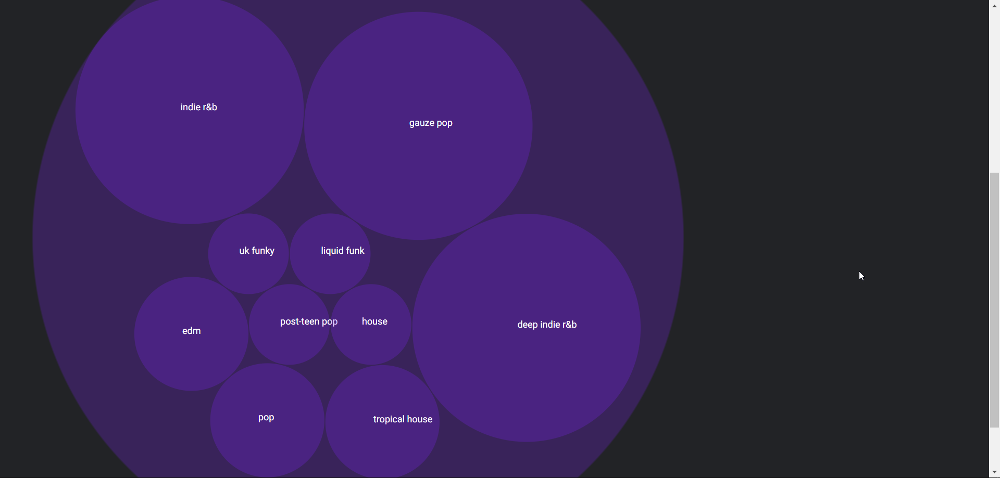

# minor-real-time-web - 22 may 2018

## Spotify realtime data

[Link to site (sockets dont work for some reason so you can only see how the app looks)](https://arcane-castle-34978.herokuapp.com/)

## About 
With this app a user can load their playlists and see the genres in them in a handy bubble chart. A user can sign in with the spotify Oauth flow and the application receives the users data. 

What I have now is a server which allows the user go trough the Oauth flow from the page. After that we get can use the users account to get their data. The scope looks like this at the moment:
```
 var scope = 'user-read-private user-read-email playlist-read-private user-follow-read user-library-read user-library-modify';
```
After the user succesfully logs in with their account a socket connection is made which we can send JSON data from the on the server to the client. A list of playlist is shown like below.


In the meantime my server is requesting the Spotify API for data. On the server this data is compared to the first time and when there are changes, the data gets sent to the client. This happens with sockets so the data changes real time. To figure out if there any changes to the playlist I use [this](https://www.npmjs.com/package/deep-diff) super handy NPM package.

Once a user clicks on a playlist, they get a page with the tracks of the playlist. For every track I do another request to get the genres. But before that I check if the playlist is stored in my mongoDB database first. By using [D3](https://d3js.org/) I create a bubble graph to illustrate how many genres there are in a playlist.



Data for the graph is sent to the specific socket.id. So each user sees data for their selected playlist.

## Features 
- Get playlist
- Get genres from all tracks in playlist
- Unfollow playlist from within the app

## Flow Chart


## Install the app
To see it live and go trough the Oauth flow your self clone this repo, run the following command in the terminal
```
git clone https://github.com/olli208/rtw-her.git
```

From the root of the directory run 
```
npm install
```

Then change these to your own you can get them [here](https://developer.spotify.com/)
```
var client_id = <client_id>
var client_secret = <client_secret>
redirect_uri= <your redirect uri>
PORT = 1000
DATABASE= <your mongoDB>
```

Then 
```
npm start
```

The site will be on [http://localhost:1000](http://localhost:1000/) or whatever the terminal says.

## Extra challenges
A user can unfollow a playlist thanks to a DELETE request to the api. This also works in realtime so the result is imediatly visible. I also added a mongoDB so we don't request everytime a user clicks on a playlist.

## source
- [Web API Authorization Guide](https://developer.spotify.com/web-api/authorization-guide/)
- [OAuth 2 Simplified](https://aaronparecki.com/oauth-2-simplified/#web-server-apps)
